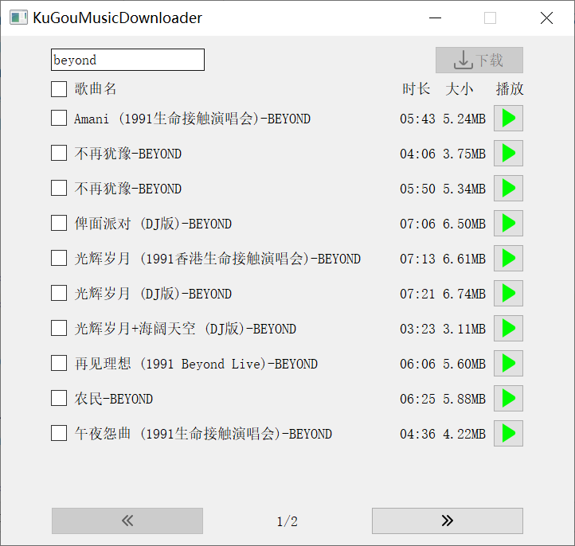

[](https://github.com/lh9171338/Outline) Music Downloader
===

# 项目介绍
这是一个音乐爬虫项目，目前支持下载酷狗音乐、QQ音乐和网易云音乐的歌曲，界面通过PyQt5实现。

## 功能

- [x] 支持[酷狗音乐](code/kugou_music_downloader.py)、[QQ音乐](code/qq_music_downloader.py)和[网易云音乐](code/neteasecloud_music_downloader.py)
- [x] 歌名搜索、歌手搜索
- [x] 在线播放歌曲
- [x] 单曲下载、批量下载
- [x] 显示、搜索、播放、下载四线程运行

## 界面
<p align="center">
  
</p>

# 项目依赖

- PyQt5
- yacs
- requests, aiohttp, selenium

```shell
# 一步安装依赖
pip install -r ./requirements.txt
```

## 代码运行
```shell
# 克隆代码仓库
git clone https://github.com/lh9171338/Music-Downloader.git
cd Music-Downloader/code

# 酷狗音乐
python kugou_music_downloader.py

# QQ音乐
python qq_music_downloader.py

# 网易云音乐
python neteasecloud_music_downloader.py
```

## 注意事项

- 在线播放歌曲是通过浏览器完成，因此本地需要安装有浏览器以及对应的驱动，仓库中提供了一个[谷歌浏览器驱动](tool)，
  程序运行时如果出现版本不匹配问题，请重新下载**合适的浏览器驱动**或者**改用其他浏览器**。
